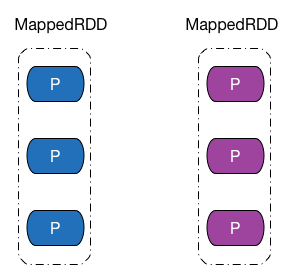

# RDD 分区

## 分区
RDD 是数据集合抽象，而在 RDD 内部，数据集又在逻辑上被分成多个分片，这样的分片我们称之为__分区（Partition）__。在后面的章节中，我们会看到：

- Spark 进行并行计算过程中，任务的个数是由 RDD 分区的数目决定的（第二章 - 调度）。
- 一个分区对应着数据存储层的一个处理单元：块（Block）（第四章 - 存储管理）。

观察 `Partition` 类的实现。

``` scala
/**
 * A partition of an RDD.
 */
trait Partition extends Serializable {
  /**
   * Get the split's index within its parent RDD
   */
  def index: Int

  // A better default implementation of HashCode
  override def hashCode(): Int = index
}
```

RDD 只是数据集的抽象，因此分区内部并不会存储具体的数据。`Partition` 类内部包含一个 `index` 成员，表示该分区在 RDD 内的编号，通过 RDD 编号 + 分区编号可以唯一确定该分区对应的块编号，利用底层数据存储层提供的接口，就能从存储介质（HDFS、Memory 等）中取出分区对应的数据。

`Partition` 是一个 Trait 类。`Partition` 衍生出许多子类，例如 `CoGroupPartition`、`HadoopPartition` 等等。

在后文中，我会用下图所示图形来表示 RDD 以及 RDD 内部的分区，RDD 上方文字表示该 RDD 的类型，分区颜色为紫红色表示该 RDD 执行了持久化操作（`persist`、`Cache`、`checkpoint` 或者数据原本存储在文件系统当中），蓝色表示该 RDD 为普通 RDD。



## 分区接口
`RDD` 抽象类中定义了 `_partitions` 数组成员和 `partitions()` 方法，后者用于获取 RDD 中的所有分区。`RDD` 的子类需要自行实现 `getPartitions()` 函数。
 
``` scala
  @transient private var partitions_ : Array[Partition] = null
  
  /**
   * Implemented by subclasses to return the set of partitions in this RDD. This method will only
   * be called once, so it is safe to implement a time-consuming computation in it.
   */
  protected def getPartitions: Array[Partition]

  /**
   * Get the array of partitions of this RDD, taking into account whether the
   * RDD is checkpointed or not.
   */
  final def partitions: Array[Partition] = {
    checkpointRDD.map(_.partitions).getOrElse {
      if (partitions_ == null) {
        partitions_ = getPartitions
      }
      partitions_
    }
  }
```

以 `MappedRDD` 类中关于 `getPartitions` 方法为例。

``` scala
  override def getPartitions: Array[Partition] = firstParent[T].partitions
```

可以看到 `MappedRDD` 中的分区实际上与父 RDD （关于父 RDD 的概念我们会在下一节讲）中的分区完全一致。


## 分区个数
创建 RDD 时候，用户可以自行指定分区的个数，例如 ` sc.textFile("/path/to/file, 2")` 表示创建得到的 RDD 分区个数为 2。

如果没有指定分区个数，对于 `parallelism` 方法：

  - 若是在本地模式运行，则默认分区数等于 `scheduler.conf.getInt("spark.default.parallelism", totalCores)`（见 `LocalBackend` 类）；
  - 若为 Mesos 集群模式运行，则默认分区数等于 `sc.conf.getInt("spark.default.parallelism", 8)`（见 `MesosSchedulerBackend` 类）；
  - 为其他模式，则默认分区数等于 `conf.getInt("spark.default.parallelism", math.max(totalCoreCount.get(), 2))`（见 `CoarseGrainedSchedulerBackend` 类）。

具体关于 `spark.default.parallelism` 值可参考[官方文档](https://spark.apache.org/docs/1.2.0/configuration.html)。在非人为指定 `spark.default.parallelism` 的情况下，Spark 通过限制分区的数目来保证集群的可用核心资源能够被充分利用。

对于 `textFile` 方法，默认分区数为 `defaultMinPartitions = math.min(defaultParallelism, 2)`（见 `SparkContext` 类）。

## 参考资料
1. 《Spark 大数据处理技术》- 夏俊鸾等著
2.  [Spark Configuration - Spark 1.2.0 Documentation](https://spark.apache.org/docs/1.2.0/configuration.html)
